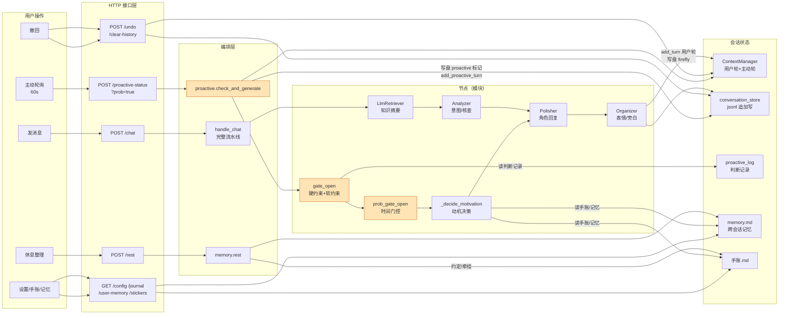

```mermaid
flowchart LR
    subgraph U["用户操作"]
        U1["发消息"] 
        U2["撤回"]
        U3["休息整理"]
        U4["主动轮询<br/>60s"]
        U5["设置/手账/记忆"]
    end

    subgraph API["HTTP 接口层"]
        A1["POST /chat"]
        A2["POST /undo<br/>/clear-history"]
        A3["POST /rest"]
        A4["POST /proactive-status<br/>?prob=true"]
        A5["GET /config /journal<br/>/user-memory /stickers"]
    end

    subgraph CORE["编排层"]
        C1["handle_chat<br/>完整流水线"]
        C2["proactive.check_and_generate"]
        C3["memory.rest"]
    end

    subgraph NODES["节点（模块）"]
        N1["LlmRetriever<br/>知识摘要"]
        N2["Analyzer<br/>意图/核查"]
        N3["Polisher<br/>角色回复"]
        N4["Organizer<br/>表情/旁白"]
        N5["_decide_motivation<br/>动机决策"]
        N6["gate_open<br/>硬约束+软约束"]
        N7["prob_gate_open<br/>时间门控"]
    end

    subgraph STATE["会话状态"]
        S1["ContextManager<br/>用户轮+主动轮"]
        S2["conversation_store<br/>jsonl 追加写"]
        S3["proactive_log<br/>判断记录"]
        S4["memory.md<br/>跨会话记忆"]
        S5["手账.md"]
    end

    U1 --> A1 --> C1 --> N1 --> N2 --> N3 --> N4
    N4 -->|"add_turn 用户轮<br/>写盘 firefly"| S1
    N4 --> S2
    U2 --> A2 --> S1
    U2 --> A2 --> S2
    U3 --> A3 --> C3 --> S4
    C3 -->|"约定/牵挂"| S5
    U4 --> A4 --> C2 --> N6 --> N7 --> N5 --> N3
    N6 -->|"读判断记录"| S3
    N5 -->|"读手账/记忆"| S5
    N5 -->|"读手账/记忆"| S4
    C2 -->|"写盘 proactive 标记<br/>add_proactive_turn"| S2
    C2 --> S1
    U5 --> A5 --> S5
    U5 --> A5 --> S4

    style C2 fill:#ffe4b5,stroke:#d2691e
    style N6 fill:#ffe4b5,stroke:#d2691e
    style N7 fill:#ffe4b5,stroke:#d2691e
```
