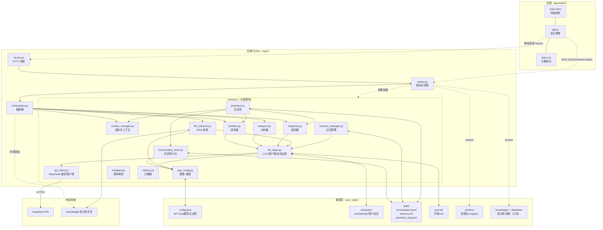

```mermaid
flowchart TB
    subgraph FE["前端（app/static/）"]
        UI["index.html<br/>页面结构"]
        JS["app.js<br/>交互逻辑"]
        CSS["style.css<br/>主题样式"]
        UI --- JS
        JS --- CSS
    end

    subgraph BE["后端 Python（app/）"]
        direction TB
        SRV["server.py<br/>HTTP 骨架"]
        RT["routes.py<br/>路由分发表"]
        ORC["orchestrator.py<br/>编排器"]
        
        subgraph MOD["modules/（功能模块）"]
            direction LR
            CFG["app_config.py<br/>配置+路径"]
            LMB["llm_base.py<br/>LLM 客户端/设定加载"]
            APIC["api_client.py<br/>DeepSeek 兼容客户端"]
            CTX["context_manager.py<br/>双轮次上下文"]
            CVS["conversation_store.py<br/>历史持久化"]
            ANZ["analyzer.py<br/>分析器"]
            POL["polisher.py<br/>回复器"]
            ORG["organizer.py<br/>组织器"]
            RET["llm_retriever.py<br/>RAG 检索"]
            MEM["memory_manager.py<br/>记忆整理"]
            PRO["proactive.py<br/>主动性"]
            MUL["multipart.py<br/>表单解析"]
            MET["metrics.py<br/>计数器"]
        end
        
        SRV --> RT
        RT --> ORC
        RT -.->|按需加载| MOD
        ORC --> ANZ
        ORC --> POL
        ORC --> ORG
        ORC --> RET
        ORC --> CTX
        POL --> LMB
        ANZ --> LMB
        ORG --> LMB
        RET --> LMB
        LMB --> APIC
        PRO --> POL
        PRO --> ORG
        PRO --> CTX
        PRO --> CVS
        MEM --> LMB
        CVS --> CFG
        LMB --> CFG
        RET --> CFG
    end

    subgraph DATA["数据层（user_data/）"]
        direction LR
        D1["config.json<br/>API Key/模型/主动性"]
        D2["character/<br/>core/identity/用户设定"]
        D3["data/<br/>conversation.jsonl<br/>memory.md<br/>proactive_log.jsonl"]
        D4["journal/<br/>手账.md"]
        D5["stickers/<br/>表情包+registry"]
        D6["knowledge/ + database/<br/>知识库/语料（只读）"]
    end

    subgraph EXT["外部依赖"]
        API["DeepSeek API"]
        KNW["knowledge/ 知识库文件"]
    end

    JS -.->|fetch /chat /proactive-status| RT
    JS -.->|静态资源 /assets| SRV
    ORC -.->|环境感知| KNW
    APIC -->|HTTPS| API
    CVS <--> D3
    MEM <--> D3
    PRO <--> D3
    CFG <--> D1
    LMB <--> D2
    LMB <--> D4
    RET <--> KNW
    RT -.->|/assets| D6
    RT -.->|/assets| D5
```
